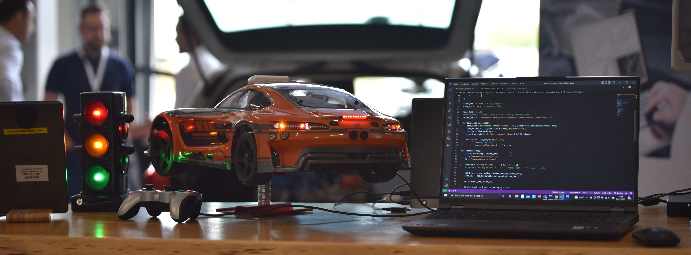

# MXcarkit

The **MXcarkit** is the ideal platform for reasarch, developement and education in autonomous driving. For more information, please visit the official product [website](https://mdynamix.de/en/mx-carkit-model-car/mxcarkit-speceifications/).



</br>

## Initial Setup
The MXcarkit is based on a ROS architecture. The setup was tested with JetPack 5.1. It is therefore recommended to install exactly the same version. However, older and newer versions should work just as well.

Follow the [instructions](https://youtu.be/Ucg5Zqm9ZMk?si=HPf8XXP5IeT5pmAy) from JetsonHacks to setup your Jeston. Use the user name *mxck* to avoid problems with the file paths. </br>
**Important:** Make sure you install Jetson Runtime Components and Jetson SDK Components in order to get GPU support.

Start the Jetson log in to your account and clone this repository.
```
git clone --recurse-submodules https://github.com/william-mx/MXcarkit.git
```

Run shell script.
```
cd ./MXcarkit
chmod +x initial_setup.sh
sudo ./initial_setup.sh
```

## Prepare STM32 Nucleo Board
Follow the [instructions](https://github.com/william-mx/MXcarkit/tree/main/stm_nucleo) to install the latest software on the microcontroller.

## Prepare VESC
Usually nothing should be changed in the VESC firmware. If you have to, follow these [instructions](https://github.com/william-mx/MXcarkit/tree/main/vesc).

## ROS Setup
Donwload the latest ros workspace from [Github](https://github.com/william-mx/mxck_ws) and and follow the instructions specified there.
