# Power Supply
## Powerbank (25000 mAh)

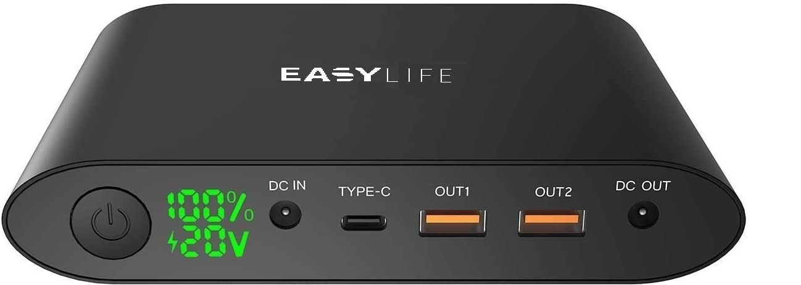

* **2 USB** (5V, 8.4V, 9V | 3A)
* **Type C** (5V, 8.4V, 9V | 3A) 
* **DC OUT** (5V, 8.4V, 9V | 3A ... 12V, 16V, 20V | 4.7A)
* **DC IN** (19V - 2A)

## LiPo Batterie (5200 mAh)

Two Lipo batteries connected in series provide **14.8 V**.

# Power Converter

* **Input from Powerbank**: (16V, 18V | 4.7A)
* **Output**: 5.2V 4.7A
  
# USB Hub
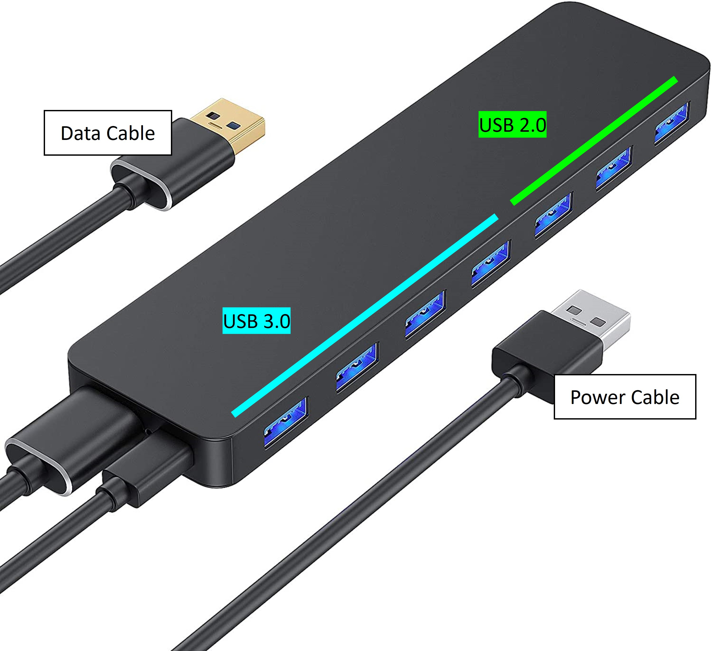

* **USB 3.0**: 5V 900mA max.
* The totality of all connected devices must not exceed (5 V | 900 mA)

# Jetson Computers
## Jetson Nano
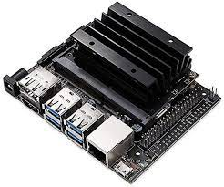

* **DC Barrel jack**: (5.5V | 5A) max.
* **Micro-USB port**: (5.5V | 2A) max.

## Jetson NX

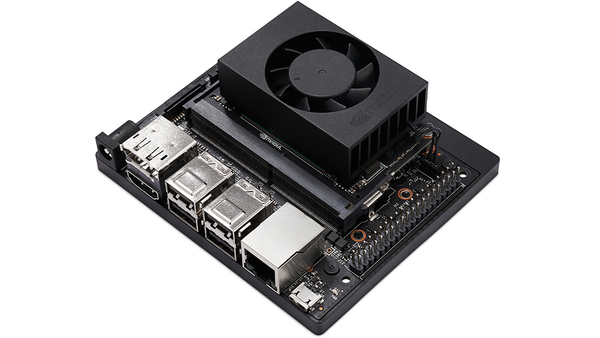

* **DC Barrel jack**: (9 - 20V | 4.4A)

# Sensors
## STM32 NUCLEO-L432KC
### Ultrasonic Sensor SEN0304

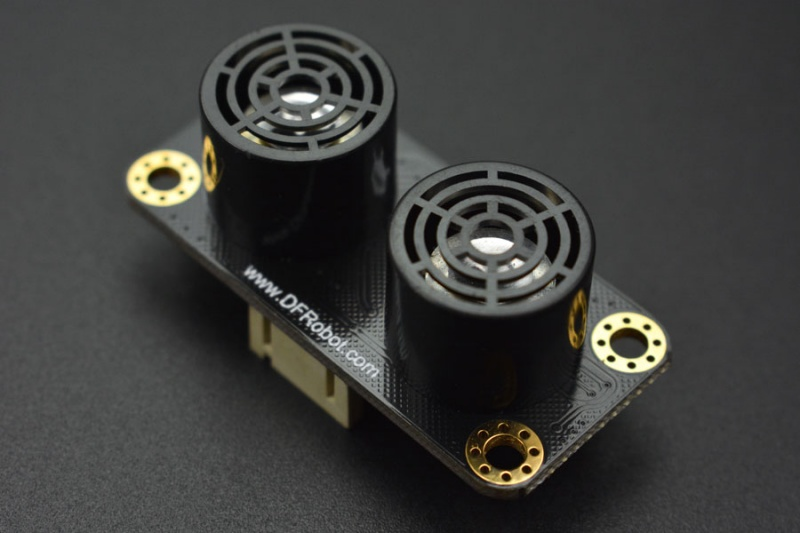

* (3.3V - 5.5V | 20mA)
* (5V | 200mA) total

### MPU6050 IMU

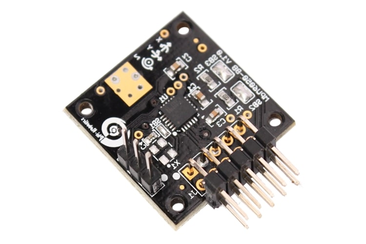

* Input power supply: 5V
* Gyroscope operating current: 3.6 mA
* Accelerometer normal operating current: 500 µA

### Syncro Kr-331 RC Receiver

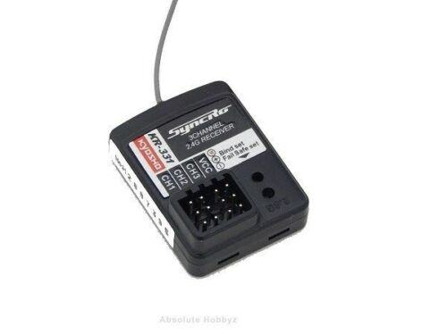

* (4.8 - 6.0V | approx. 20mA)

### Illumination Adafruit LED Driver

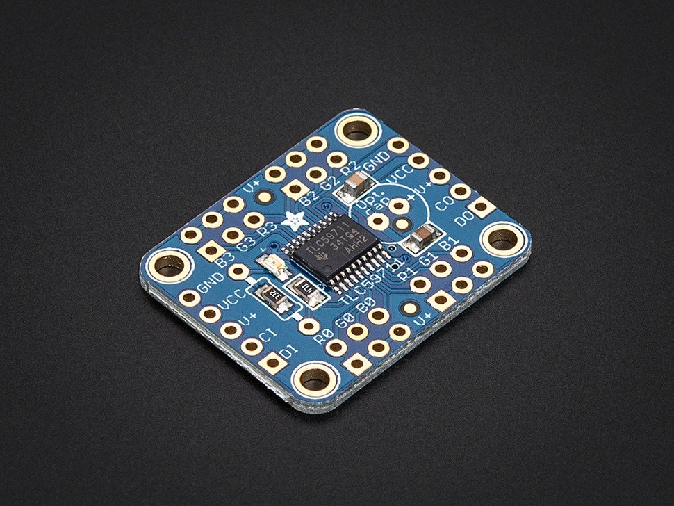

* **LED-Driver**: 5-17 V
* 8 Standard-LEDs with 20mA max. each
* LED Stripe with 40mA max. (5mA per LED)
* 200mA total max. 

## RealSense D435i

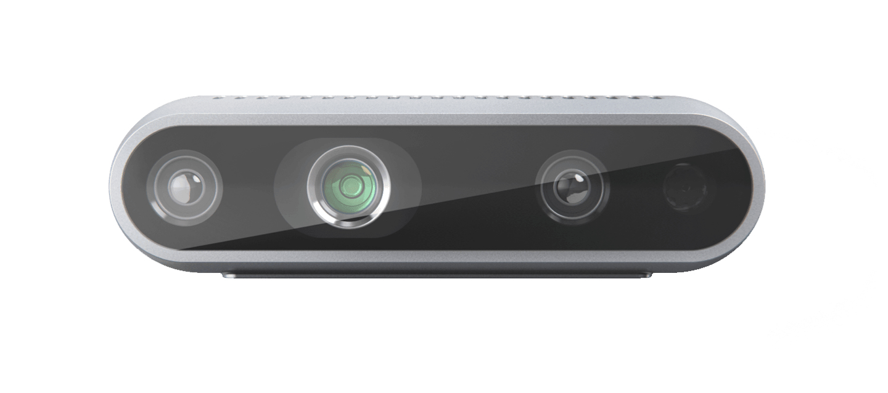

* (5.25V | 700mA) max.

## RPLidar A2M8

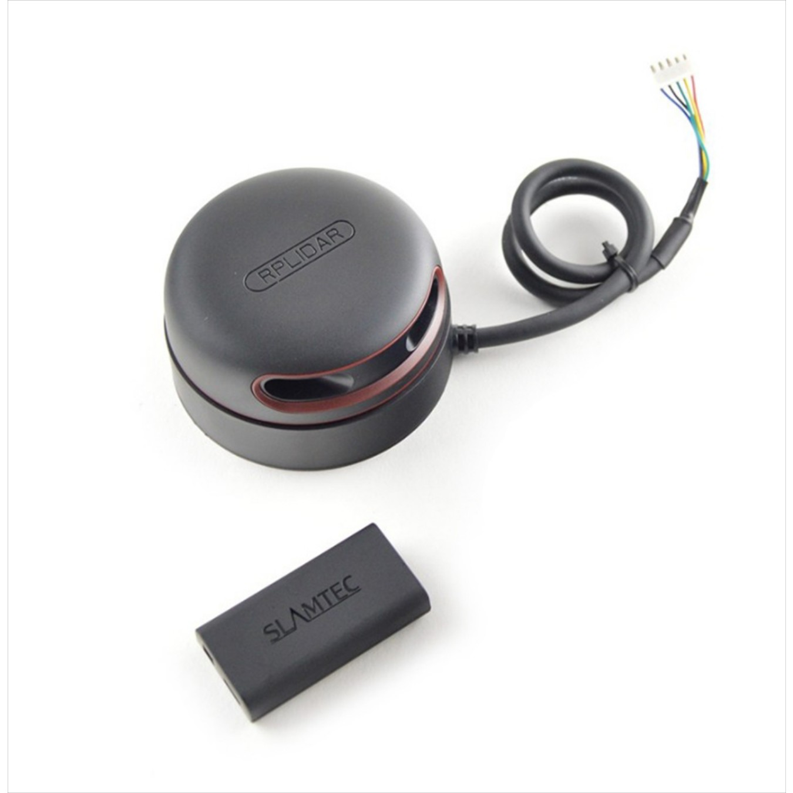

* (5.5V | 600mA) max.

# Recommended power supply

Use the external power supply for the lidar and connect it to the USB port of the powerbank. This unloads the Jetson.

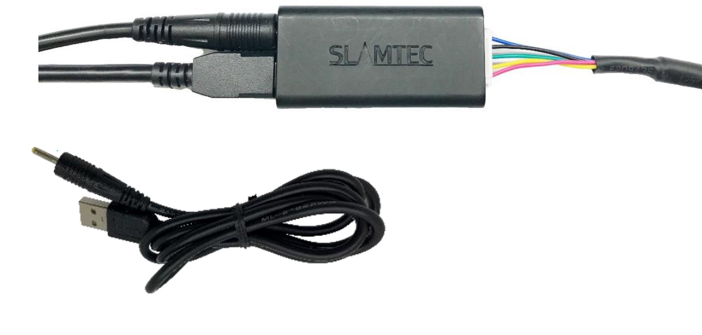

Use the power converter and connect it to the DC OUT port of the powerbank. Set the powerbank to min. 16V by double clicking several times. From that moment on the powerbank delivers 4.7V instead of 3V to the Jetson.

Connect the USB hub to a USB port of the powerbank and then connect the Nucelo to one of the free ports. The Jetson is relieved by the external power supply. Make sure that the allowed 900mA at the USB hub is not exceeded. 

*Testing*: To avoid the possibility that the power supply of the USB hub has a loose contact: Disconnect data cable, plug smartphone or similar into a free port and see if the device is supplied with power.

With the above setup, the Jetson should no longer have any problems with the power supply.  In case of problems, e.g. by connecting more devices, the free USB-C port on the powerbank can be connected with a data power splitter cable. This further reduces the load on the Jetson.

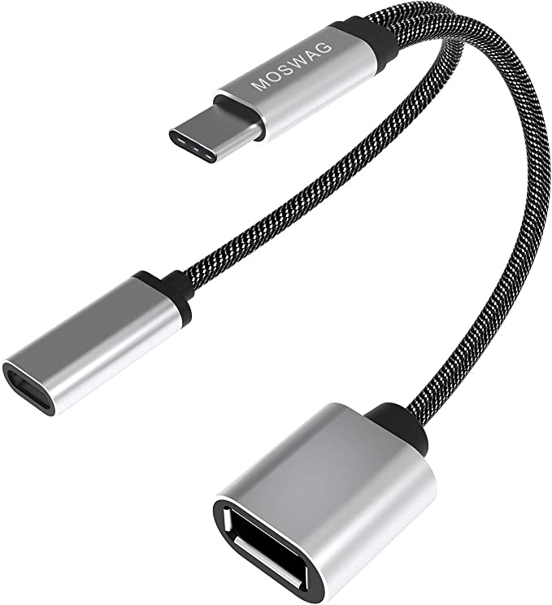
