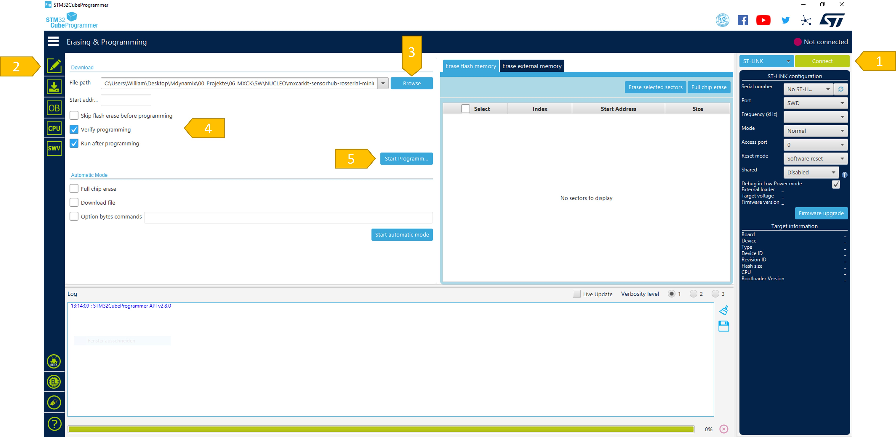

# STM Nucleo Programming

### **Initial Setup**

Install the [STM32CubeProgrammer](https://www.st.com/en/development-tools/stm32cubeprog.html) on your host PC and connect the microcontroller with a [USB extension cable](http://www.amazon.de/dp/B07WLNG1XJ/).

### **Programming**

1. Connect the microcontroller.
2. Switch to programming tab.
3. Browse for the binary software file you previously downloaded from this repository.
4. Check the setup.
5. Start programming.
6. Unplug the extension cable from the microcontroller and connect it back to the jestson.

