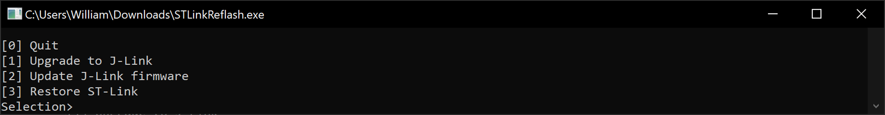
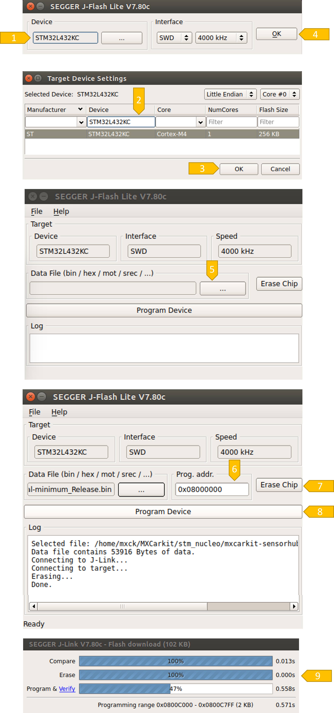

# STM Nucleo Programming

# Table of contents
1. [Introduction](#introduction)
1. [Using STM32CubeProgrammer](#p1)
1. [Using J-Link Flash (recommended)](#p2)


## Introduction <a name="introduction"></a>
The Mictocontroller can be programmed in two ways. For the first option we use the **STMCubeProgrammer**. To do so, we have to unplug the microcontroller from the Jetson and connect it to our notebook to install the software. For the second option we use the **J-Link Flash Tool** from Segger and can program the microcontroller directly from the Jetson **(recommended)**.

### **Preparation**
The microcontroller must be set to STLink in order to use the STMCubeProgrammer. For the J-Link Flash Tool we need J-Link.
Newer versions of MXCarkit are shipped with J-Link by default. Older versions must first be converted to use the J-Link Flash Tool. To do so, we have to download and unpack  [SEGGER STLinkReflash](https://www.segger.com/products/debug-probes/j-link/models/other-j-links/st-link-on-board/). Next connect the microcontroller to the computer, launch STLinkReflash tool, select ```[1] Upgrade to J-Link``` and wait for operation to complete. In order to use the STMCubeProgrammer you can set the microcontroller back to ST-Link using ```[3] Restore ST-Link```. 



Continue with [Using STM32CubeProgrammer](#p1) or [Using J-Link Flash (recommended)](#p2).


## Using STM32CubeProgrammer <a name="p1"></a>
### **Initial Setup**

Install the [STM32CubeProgrammer](https://www.st.com/en/development-tools/stm32cubeprog.html) on your host PC and connect the microcontroller with a [USB extension cable](http://www.amazon.de/dp/B07WLNG1XJ/).


### **Programming**


1. Connect the microcontroller.
2. Switch to programming tab.
3. Browse for the binary software file you previously downloaded from this repository.
4. Check the setup.
5. Start programming.
6. Unplug the extension cable from the microcontroller and connect it back to the Jetson.

## Using STM32CubeProgrammer <a name="p2"></a>

### **Initial Setup**

Download and install the [64-bit DEB Installer](https://www.segger.com/downloads/jlink/) on Jetson NX or the [32-bit DEB Installer](https://www.segger.com/downloads/jlink/) on Jetson Nano. Open a terminal and run ```JFlashLite``` to start the flash tool. 


### **Programming**



1. Set the device.
2. Search for *STM32L432KC*.
3. Confirm with *OK*.
4. Confirm with *OK*.
5. First download the latest software from our repository and then select it.
6. Set the correct programming address *0x080000*!
7. Erase the chip
8. Program the device.
9. A statusbar indicates that everything is working correctly.


