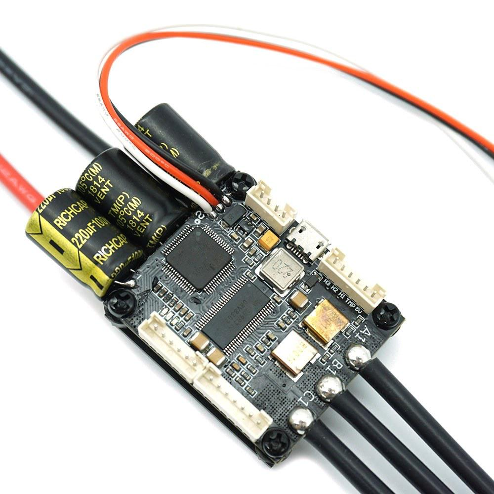
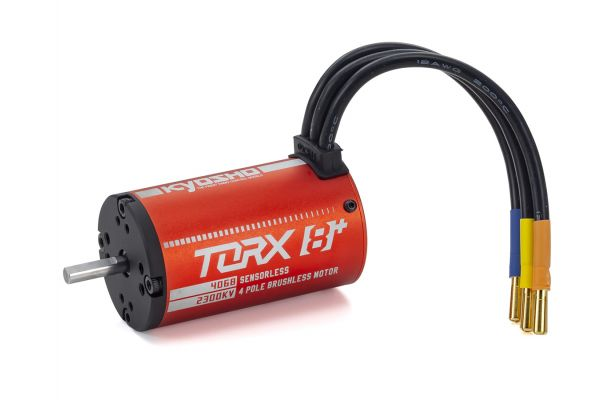
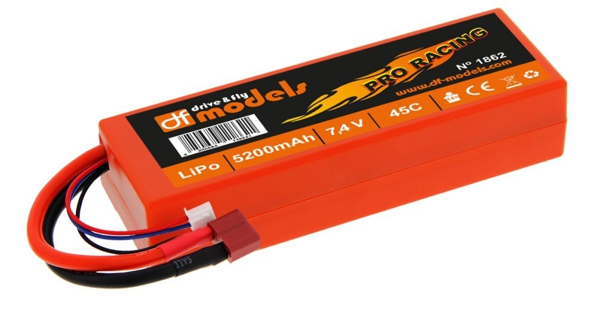

# VESC
An electronic speed control (ESC) is an electronic circuit that controls and regulates the speed of an electric motor. 

Installed ESC:  [FSESC 4.12 50A Based on VESC4.12](https://flipsky.net/products/torque-esc-vesc-%C2%AE-bldc-electronic-speed-controller)

 

 

The BLDC and the servo motor are controlled by the VESC and is powered by the two Lipo batteries.

  
   

 

The BLDC has **4 poles** and a kv rating of **2300 kV**. The fully charged Lipo batteries deliver **16.8 V** and **14.8 V** at a capacity of 15%. From the moment the lipos should be disconnected and recharged.

The maximum rpm of the motor that can be safely reached is calculated with *rpm = kV * U*. Our maximum rpm are thus: 2300 kV * 14.8V = **34.040 rpm**

That would be much too fast and the wheels would slip. Therefore, we set a maximum speed and calculate the rpm for it.

We have a wheel diameter of 97 mm and therefore a wheel circumference *U* of approx. 305 mm. We define a maximum speed  *vmax* = 15 km/h = 250000 mm/min. So we get *vmax / U ≈ 820 rpm*.

For the vesc configuration we have to convert this into erpm and get it rpm * n_poles = 820 * 4 ≈ **3280 erpm**.

Next we set the value for *battery cutoff start* and *battery cutoff end*. When the battery has been discharged to the start value, the power supplied to the motor will steadily decrease. When the end value is reached it won't spin at all. We set **battery cutoff start = 15V** and **battery cutoff end = 14.8V**. This protects the battery from deep discharge.

Next we set the values for *Motor min (regen)* and *Batt min (regen)*.

 

**Motor min (regen)**: The maximum current output you allow your motor to produce when operated as a generator. Electric vehicles may use the motor as a brake, generating energy when slowing down the vehicle. The energy produced will be stored in the battery. We will set the value to -20A to get started. The value should not be higher than the max. continuous current specification of the motor.

**Hint:** Higher values will result in stronger brakes if the Battery Current Max Regen settings allows the storage of the current generated.

**Batt min (regen)**: The maximum current you allow the ESC to push towards your battery or battery management system (if incorporated in your system) when braking. Battery Current Max Regen is important for **brake strength at speed!** Low settings result in weak brakes at speed! This value should not exceed the maximum burst charge current rating of your battery or capability of your battery management system. So lets set that to -10A.

**Batt max**: Our Lipo is specified as 5400mAh and 45C. Our max. output current is calculated with Imax = 5.4Ah * 45C = 234A. Manufacturers often overrate the batteries and cutting the value in half is recommend. 
That's why we set 120A as the limit.

Klick [here](https://vesc-project.com/node/938) for further information.

