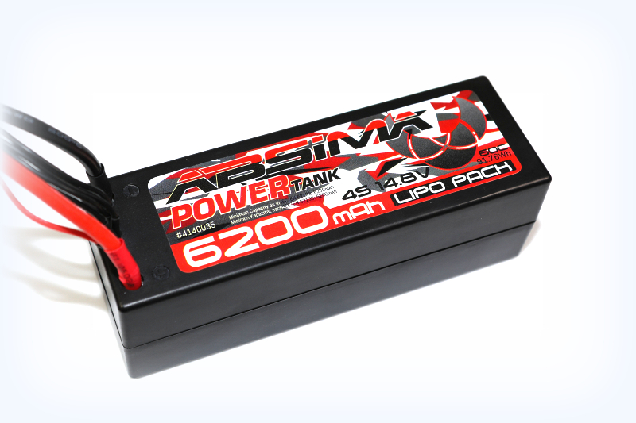
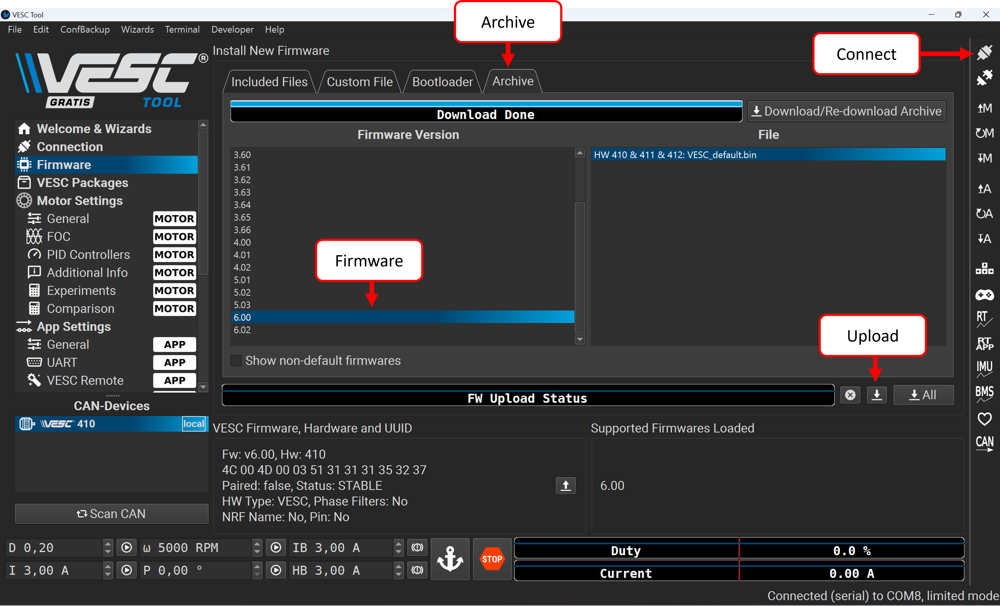
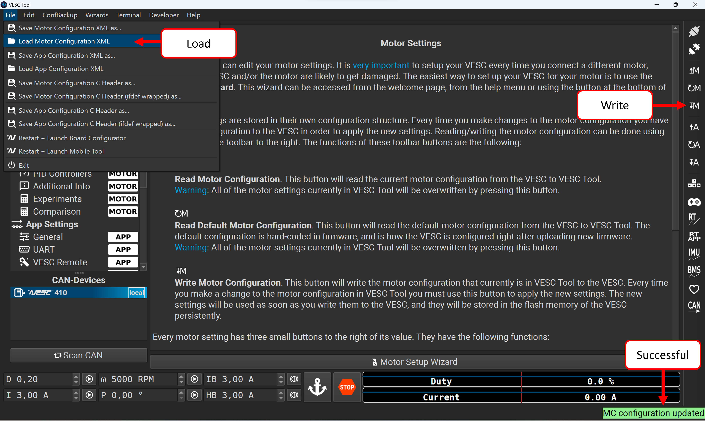
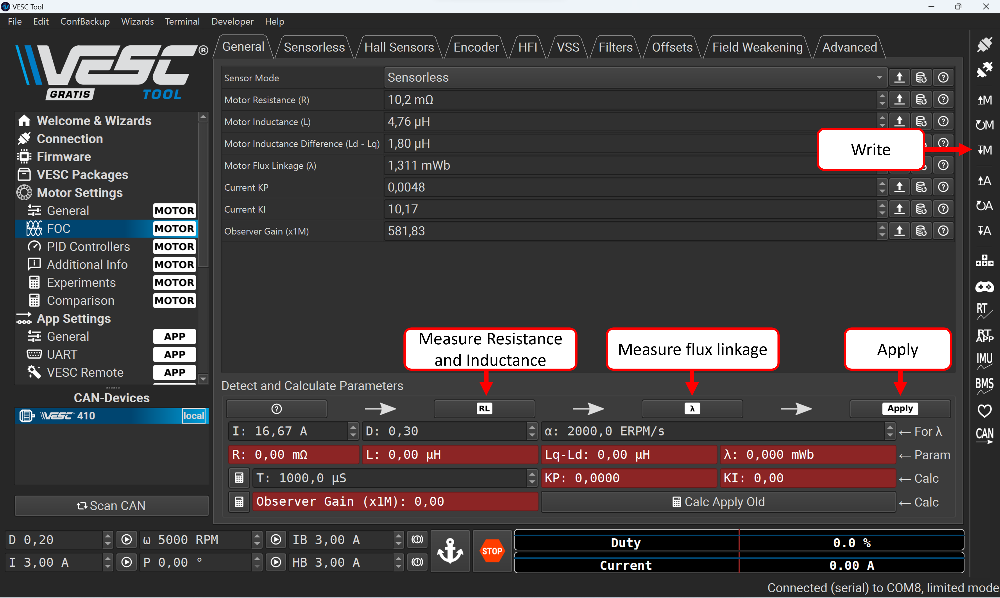
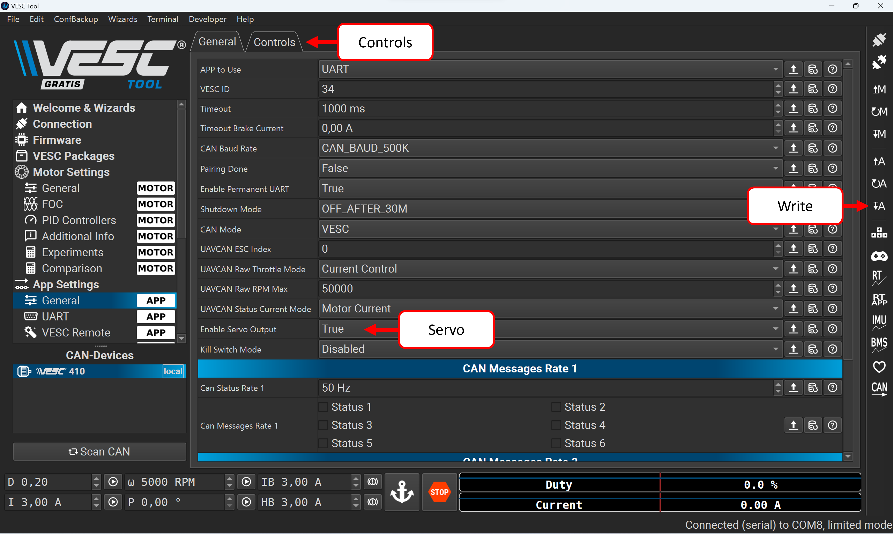

# VESC Configuration and Specifications Guide

In this section, we describe the most important parameters of our Electronic Speed Controller (ESC) and how you can configure it for optimal performance. Understanding the installed components and their specifications is crucial for proper configuration.

## Electronic Speed Controller (ESC) 

### FSESC 4.12 50A Based on VESC4.12

- **EPRM:** `60000` - his is the maximum Electrical RPM (revolutions per minute) the ESC can handle. Electrical RPM considers the number of pole pairs in the motor and is a factor in calculating the actual RPM.
- **Current:** `50A continuous / 240A peak` - Specifies the maximum electrical current the ESC can handle continuously, with peak values for short durations.
- **Voltage Range:** `8V-60V` - The range of input voltage the ESC can safely operate within.
- **BEC:** `5V@1.5A` - BEC (Battery Eliminator Circuit) provides a stable 5V output at up to 1.5A to power the receiver and servos, eliminating the need for a separate battery pack.
- **Motor Control Interfaces:** PPM, analog, UART, I2C, USB, CAN-bus - Various interfaces for connecting and communicating with the ESC for motor control.

## Brushless DC Motor

### Kyosho Speed House Torx 8+

- **KV Rating:** `2300KV` - KV rating indicates the motor's speed. At 2300KV, the motor will theoretically turn 2300 RPMs per volt without load. So, for a 4S LiPo battery (14.8 volts nominal), it would spin at approximately 29.600 RPMs.
- **Number of Poles:** `4` - Motors with more poles, like this one with 4 poles, tend to offer smoother operation and enhanced torque at lower speeds, contributing to better control and efficiency in various driving conditions.
- **Input Voltage:** `LiPo 2-4S` - The motor is designed to operate with LiPo batteries ranging from 2-cell (2S) to 4-cell (4S). This translates to a voltage range of roughly 7.4 volts to 14.8 volts.
- **Weight:** `352g` - The weight of the motor is 352 grams.

## Battery Pack

### Absima Power Tank 4S LiPo

- **Voltage:** `14.8V` - The total voltage of the battery pack, which is the sum of the voltages of individual cells connected in series (3.7V per cell for a 4S pack).
- **Capacity:** `6200mAh` - The amount of charge the battery can hold, indicating how long it can provide a certain level of current (6200mAh means 6.2 amps for 1 hour).
- **Discharge Rate:** `60C` - The maximum rate at which the battery can be discharged safely. A 60C rating means the battery can discharge at 60 times its capacity, equating to 372 amps peak current (60 x 6.2A).
- **Configuration:** `4S` - Indicates that there are four lithium polymer cells connected in series within the pack.

## RC Car

### ReadySet Kyosho Mercedes-AMG GT3 1:8

- **Wheel Diameter:** `97 mm` - Essential for calculating vehicle speed from wheel RPM.

- **Gear Ratio:** `8.95:1` - Crucial for translating motor RPM to drive axle speed.

# VESC Tool Configuration Guide

We utilize the [VESC Tool 6.02](https://vesc-project.com/vesc_tool) to apply firmware updates and configure both the motor and application settings, ensuring optimal performance and compatibility.

## Flashing Firmware

Firmware is the low-level software that directly manages the hardware of the VESC, enabling control over motor parameters, application settings, and system behavior. Ensure the VESC Tool is installed, the VESC is connected to the computer via USB, and powered by the LiPo battery for setup. Our Flysky VESC uses the VESC 4.12 standard. The VESC Tool is compatible with several versions, including our `410 & 411 & 412` series. Explore different firmware versions in the `Archive` tab. We tested the setup with the latest firmware version `6.02`. Choose the appropriate firmware by verifying the Hardware Version, then upload it to the VESC.

## Update Motor Configuration

The motor configuration is stored as an XML file. Navigate to `File > Load Motor Configuration XML`. Choose the `mxck_motor_config.xml` file from our repository. Proceed by clicking the `Write Motor Configuration` button located on the right-side panel. A successful update is confirmed by a green `MC configuration updated` message displayed at the bottom right corner.

## Parameterize Motor

Next, we need to parameterize our motor: Select `Motor Settings > FOC > General`. Make sure your vehicle is securely placed on a stand with the wheels free to spin. Start by measuring the motor's Resistance and Inductance for optimal operation. Next, determine the Flux Linkage to evaluate the motor's magnetic efficiency. Upon successful measurement, fields will highlight in green—click `Apply` to save. To finalize, click `Write Motor Config` to store these settings in the VESC.

## App Configuration

Finally, activate the Servo Output feature by heading to `App Settings > General` in the VESC Tool. Toggle `Enable Servo Output` to True. Confirm the changes by clicking `Write app configuration`. To check the functionality, visit the `Controls` tab, where adjusting the slider should vary the servo position, turning the wheels accordingly.

## Suggested Electrical Settings

- **Motor Current Max**: `50A`
  - **Explanation**: Matches the continuous current capability of the ESC. This ensures that the motor does not draw more current than the ESC can handle, preventing overheating and potential damage.

- **Motor Current Max Brake**: `-50A`
  - **Explanation**: The maximum reverse current allowed for braking. Set to the same as the Motor Current Max to provide strong braking without exceeding the motor's rated specs.

- **Absolute Maximum Current**: `240A`
  - **Explanation**: Correlates with the ESC's peak current rating. This is a safety feature to ensure that the system can handle short bursts of high current without incurring damage.

- **Battery Current Max**: `60A`
  - **Explanation**: Set conservatively to not exceed the continuous discharge rating of the battery. While the battery can theoretically handle much higher currents, this limit helps to safeguard battery life and system integrity.

- **Battery Current Max Regen**: `-20A`
  - **Explanation**: This is set with consideration for the safe charging rate of the battery during regenerative braking. It is a conservative value that respects the general safe charging guidelines for LiPo batteries and ensures longevity.

- **Cut-off Start**: `14.0V` _(3.5V per cell)_
  - **Explanation**: This is the voltage at which the ESC begins to reduce power, serving as an early warning that the battery is approaching its minimum safe voltage.

- **Cut-off End**: `12.8V` _(3.2V per cell)_
  - **Explanation**: This is the voltage at which the ESC will stop the vehicle, preventing further discharge of the battery to protect it from damage.

- **Minimum Input Voltage**: `12.0V`
  - **Explanation**: This prevents the ESC from operating if the battery voltage drops below 3.2V per cell, protecting the battery from over-discharge.

- **Maximum Input Voltage**: `18.0V`
  - **Explanation**: This prevents the ESC from receiving voltage higher than 4.2V per cell, protecting the ESC and the battery from overvoltage conditions.

- **Max ERPM and MAX ERPM Reverse**: `+/- 30000`
  - **Explanation**: The maximum rpm of the motor that can be safely reached is calculated with *rpm = kV * U*. Our maximum rpm are thus: 2300 kV * 14.8V = 34.040 rpm. For safety, we don't set the value to the limit, but to 30000.

- **Ramp ERPMs per Second**: `6000`
  - **Explanation**: This setting determines the rate at which the motor's electrical revolutions per minute (ERPM) can increase, allowing for smooth acceleration while preventing sudden surges in speed.

- **Minimum ERPM**: `1200`
  - **Explanation**: In sensorless Field-Oriented Control (FOC) mode, the motor relies on the back electromotive force (EMF) generated by its rotation to determine its position and speed. However, at very low speeds, this back EMF may not be strong enough or consistent enough for accurate control. By setting a minimum ERPM, such as 1200 in this case, we ensure that the motor maintains a minimum speed at which the back EMF is reliable enough for the FOC algorithm to function smoothly without stalling or losing synchronization. This helps prevent performance issues and ensures stable operation of the motor.

- **Speed PID Kp, Kd, and Ki**:
  - **Explanation**: These parameters are crucial for achieving smooth motor control. They represent the proportional, derivative, and integral gains of the PID (Proportional-Integral-Derivative) controller used for regulating motor speed. Adjusting these parameters effectively balances the motor's response to changes in speed, ensuring stable and accurate control. There are various methods for fine-tuning these parameters, including manual adjustment based on trial and error, or utilizing automated tuning methods to optimize performance.
